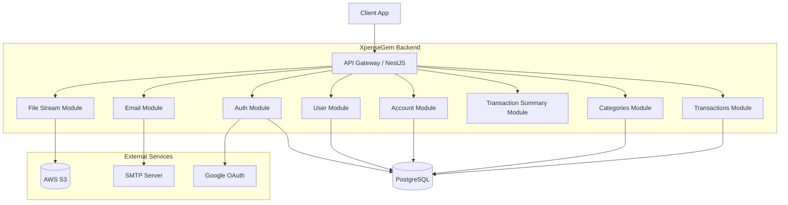
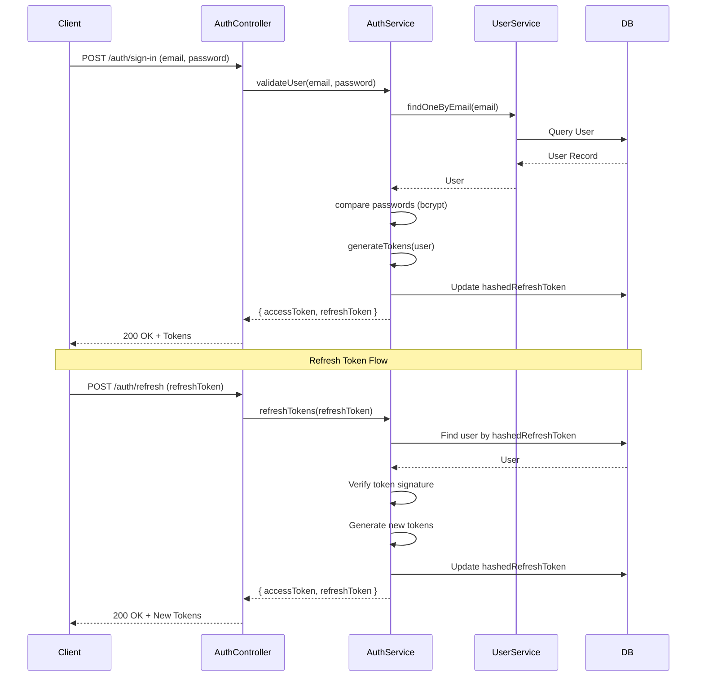
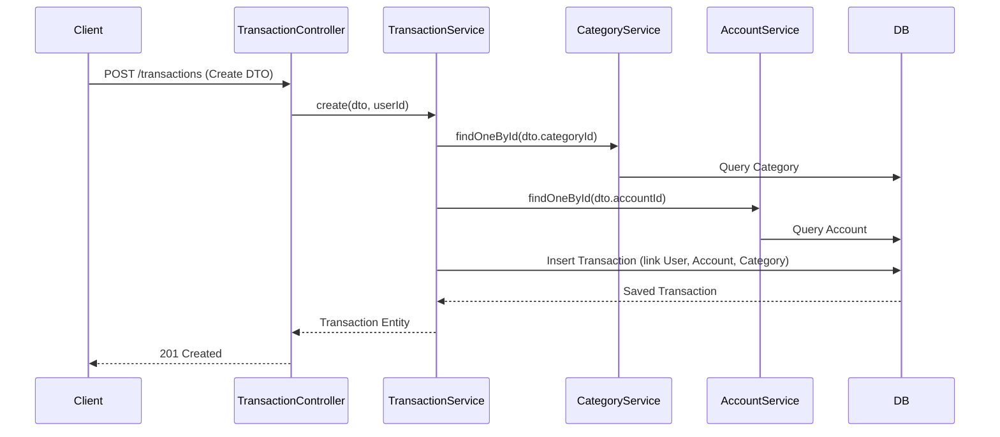
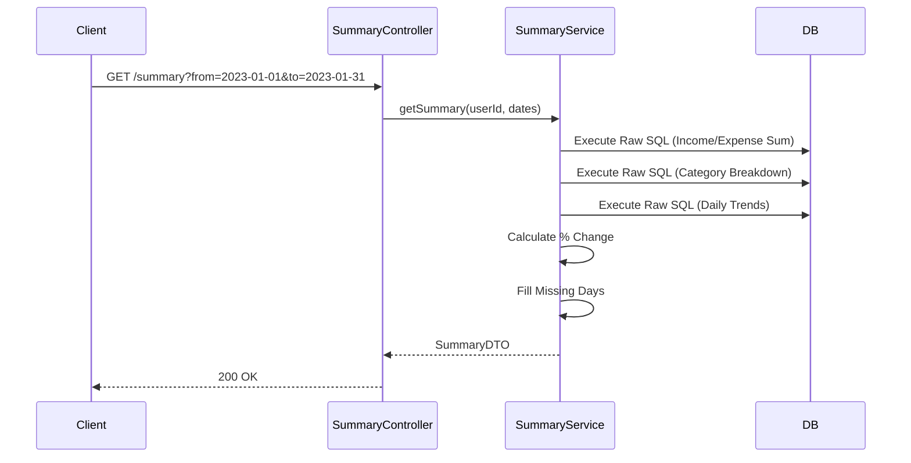

# XpenseGem Backend Architecture

## 1. High-Level Overview

**XpenseGem** is a backend application built with **NestJS** and **TypeORM**, designed to manage personal finances, including tracking transactions, accounts, categories, and generating summaries. It follows a modular monolithic architecture.

### Key Technologies

- **Framework**: NestJS
- **Database**: PostgreSQL
- **ORM**: TypeORM
- **Authentication**: JWT (Access & Refresh tokens), Google OAuth
- **File Storage**: AWS S3
- **Email**: Nodemailer (with Pug templates)
- **Logging**: Winston (daily rotating files)

---

## 2. System Architecture Diagram

---

## 3. Module Deep Dives

### 3.1 Database Configuration (`src/common/database`)

**Connection Setup:**

- **Type**: PostgreSQL
- **Naming Strategy**: `SnakeNamingStrategy` (converts `camelCase` to `snake_case`)
- **Configuration**: Loaded via `ConfigService` (env variables).
- **Entities**: Auto-loaded from `src/modules/**/*.entity.ts`.
- **Subscribers**: Auto-loaded from `src/modules/**/*.subscriber.ts`.
- **Migrations**: Stored in `src/common/database/migrations`.

**Base Entity (`entity.abstract.ts`):**
All entities extend `AbstractEntity` which provides:

- `id`: UUID (Primary Key)
- `createdAt`: Timestamp
- `updatedAt`: Timestamp

**Key Entities:**

- **User**: Authentication details (password, hashed refresh token, reset tokens).
- **Account**: User-owned financial accounts.
- **Category**: Expense/Income classification.
- **Transaction**: Financial records linked to User, Account, and Category.

### 3.2 Authentication Flow (`src/modules/auth`)

**Strategy:**

- **Access Token**: JWT Bearer token. Verified via `passport-jwt`.
- **Refresh Token**: JWT stored in cookies or body (implementation specific). Hashed and stored in DB (`users.hashed_refresh_token`).

**Process Flow:**

1.  **Sign In**:
    - User provides email/password.
    - `AuthService` validates credentials.
    - Generates Access & Refresh tokens.
    - Refresh token is hashed and saved to DB.
    - Tokens returned to client.
2.  **Token Refresh**:
    - Client sends refresh token.
    - `RefreshTokenStrategy` validates token signature.
    - `AuthService` verifies token hash against DB.
    - If valid, new access/refresh tokens are issued.
3.  **Sign Out**:
    - Refresh token hash is removed from DB.

**Guards:**

- `AuthJwtGuard`: Protects routes requiring authentication.
- `@SkipAuth()`: Decorator to bypass auth for specific routes (e.g., login, signup).

### 3.3 Transaction Flow (`src/modules/transactions`)

**Entity Relationships:**

- `Transaction` belongs to `User`, `Account`, and `Category`.
- Cascade delete is enabled (deleting a user deletes their transactions).

**Service Logic:**

- **Create**: Inserts new transaction. Enforces user ownership.
- **Find All**: Supports pagination, sorting, and filtering (search by payee/notes).
- **Update**: Modifies existing transaction (checks ownership).
- **Remove**: Deletes transaction (checks ownership).

**Financial Logic:**

- `amount`: Integer. Positive for Income, Negative for Expenses.

### 3.4 Transaction Summary Generation (`src/modules/transaction-summary`)

**Purpose:**
Generates aggregated financial data for dashboards (Income vs Expense, Category breakdown, Daily trends).

**Calculation Logic:**

- **Income/Expense Sums**: Uses SQL `CASE` statements to separate positive and negative amounts.
- **Category Breakdown**: Groups transactions by category, sums amounts.
- **Daily Trends**: Fills missing days with zero for continuous charts.
- **Percentage Change**: Compares current period vs previous period.

**Flow:**

1.  **Request**: Client requests summary for a date range (default: current month).
2.  **Query**: Service executes raw SQL queries via TypeORM repository for performance.
3.  **Processing**: Calculates percentage changes and fills data gaps.
4.  **Response**: Returns structured DTO with summary data.

### 3.5 File Storage (`src/modules/file-stream`, `src/common/aws`)

**AWS S3 Service:**

- Uses `@aws-sdk/client-s3`.
- Supports multipart uploads for large files.
- Operations: List, Get, Put, Delete (single/multiple).

**File Stream Service:**

- Wraps S3 downloads into NestJS `StreamableFile`.
- Efficient for large files (streaming download).

**Storage Paths:**

- Profile Pictures: `/private/profile`
- Generic Files: `/private/{uuid}`

---

## 4. Data Flow Diagrams

### 4.1 Authentication Flow (Sign In & Refresh)

### 4.2 Transaction Creation Flow

### 4.3 Summary Generation Flow

---

## 5. Infrastructure & Deployment

### Environment Variables

- `DATABASE_*`: Connection details for PostgreSQL.
- `API_PORT`, `API_PREFIX`, `API_CORS_ORIGIN`: Server configuration.
- `AWS_*`: S3 credentials and bucket names.
- `JWT_SECRET`, `JWT_EXPIRATION`: Authentication secrets.
- `EMAIL_*`: SMTP server configuration.

### Docker

A `Dockerfile` is present for containerization.

### Migrations

- `pnpm migration:generate`: Create new migration based on entity changes.
- `pnpm migration:run`: Apply migrations to DB.
- `pnpm migration:revert`: Revert last migration.

### Testing

- **Unit Tests**: Jest (`.spec.ts` files).
- **E2E Tests**: Jest (configured in `test/jest-e2e.json`).

### Code Quality

- **Linting**: ESLint.
- **Formatting**: Prettier.
- **Git Hooks**: Husky (pre-push).
